# Blog Application

A simple web application using ejss

:point_right: [Click me to see the example!(抱歉这次没有例子)]() :point_left:

---

### content

- [主要功能展示](#main-function)
- [关键步骤](#core-step)
    - [页面预置](#pageSet)
        - [home](#homeSet)
        - [about](#aboutSet)
        - [contact](#contactSet)
    - [获取compose页面输入内容](#composeGet)
    - [在主页显示已发布过的内容](#homeShow)
    - [点击内容跳转到相应的页面](#jumpTo)
- [Tips](#tips)
    - [npm istall](#npmInstall)
    - [首页发布项的省略](#postOmit)
    - [待加入功能](#futureFunction)
- [应用方向](#apply)
---
<h3 id="main-function">主要功能展示</h3>
这是一个简单的网上发布博客应用，简单的来说就是可以实时地在网页中显示用户发布过内容，并查看详情界面，本次项目使用ejs工具来帮助实现。

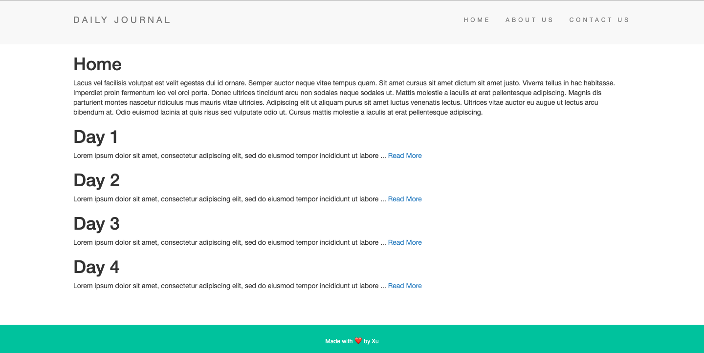

点击导航栏，可以跳转至相应的界面

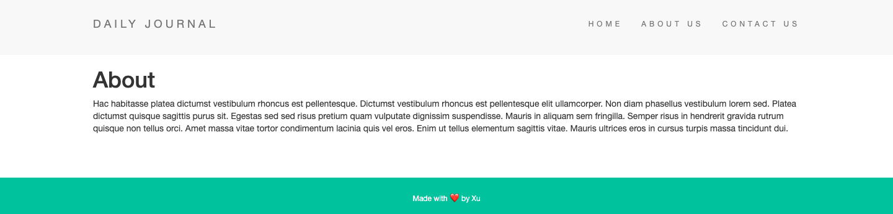

在compose发布界面还可以发布相关内容，并且在首页显示

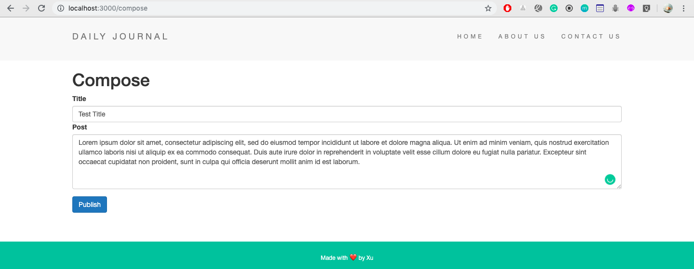

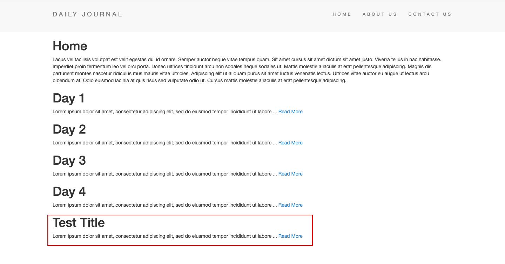

---
<h3 id="core-step">关键步骤</h3>
<h4 id="pageSet">页面预置</h4>
将大致页面的结构，样式编写完成后，首先就是导航跳转项的页面预置，由于各个页面具有相同的页首和页脚，将这两个部分单独存放在一个文件夹中，再到各个页面当中去调用（应当注意文件间的相对路径）。

本次项目的views文件中的结构为：
```
views
    -partials
        -header.ejs
        -footer.ejs
    -about.ejs
    -compose.ejs
    -contact.ejs
    -home.ejs
    -post.ejs
```

参考ejs文档

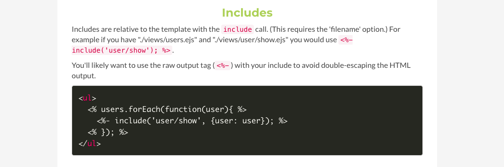
根据项目的页面文件结构，在各个界面中调用页首（header）和页脚（footer）的代码为：

```html
<%- include("partials/header"); %>
<%- include("partials/footer"); %>
```

接着就是在js文件中做好项目的基本配置（要先使用npm在终端中安装好需要使用的express，body-parser，ejs）

```js
// app.js
//jshint esversion:6

const express = require("express");
const bodyParser = require("body-parser");
const ejs = require("ejs");

const app = express();

app.set('view engine', 'ejs');
app.use(bodyParser.urlencoded({extended: true}));

app.use(express.static("public"));
// 为了向网页中传递样式，需要在Express中提供静态文件

// 为每个页面提供不同的访问路径
app.get("/", function(req, res) {
    res.render("home");
});

app.get("/about", function(req, res) {
  res.render("about");
});

app.get("/contact", function(req, res) {
  res.render("contact");
});

app.get("/compose", function(req, res) {
  res.render("compose");
});

app.get("/post", function(req, res) {
  res.render("post");
});

// 项目从localhost:3000进行连接
app.listen(3000, function(req, res) {
    console.log("Server started on port 3000.");
});
```

为了在不同的页面展现不同的内容，可以采取两种方式。第一种就是直接在其对应的页面中编写;第二种是在后台将要展示的内容存放在变量中，通过ejs的变量传递，在对应界面中显示后台的变量内容。本次项目使用后者，现以about界面的内容为例子进行介绍。
根据文档，我们需要在js文件中定义好要显示的内容变量,并且传递到about界面当中去。

```js
const aboutContent = "Hac habitasse platea dictumst vestibulu...";

app.get("/about", function(req, res) {
    res.render("about", {aboutContent: aboutContent});
});
```

然后进入about.ejs中使用该传递的变量

```html
<%- include("partials/header"); %>
    <h1>About</h1>
    <p> <%= aboutContent %> </p>
<%- include("partials/footer"); %>
```

其中，"<%= %>"用于显示传递于页面中的内容，将要使用的变量名写入"="之后即可。

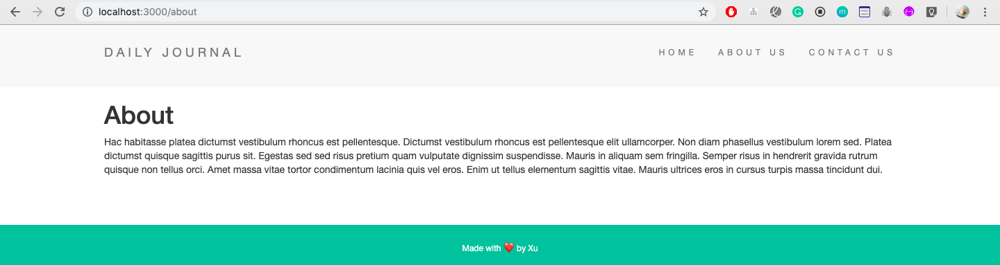

其他的页面预置方法与此一致。
<h4 id="composeGet">获取compose页面输入内容</h4>
当用户在/compose界面进行内容发布时，需要在后台获取用户发布内容，以特定的形式存储在数组中，方便后续在主页显示。

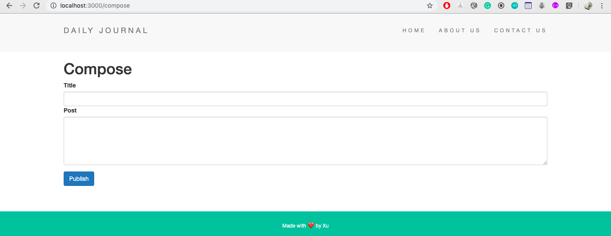

首先，在compose.ejs界面中，写好需要发布内容的功能块（注意，form的action地址应与页面所在地址一致,方法为POST，并且应记下表单选项的名称，需要在后台调用）

```html
<form action="/compose" method="POST">
    <div class="form-group">
        <label for="postTitle">Title</label>
        <input type="text" name="postTitle" class="form-control">
        <label for="postBody">Post</label>
        <textarea name="postBody" class="form-control" rows="5"></textarea>
    </div>
    <button class="btn btn-primary" type="submit" name="button">Publish</button>
</form>
```

记下了一条发布内容的名称为<font color = red>postTitle</font>,发布内容为<font color = red>postBody</font>，然后新建一个数组posts专门用来存储具有这两个属性的对象。

```js
const posts = [];

app.post("/compose", function(req, res) {
    const post = {
        title: req.body.postTitle,
        content: req.body.postBody
    };
    posts.push(post);// 将发布内容加入posts中保存
    // console.log(posts);
    res.redirect("/");// 发布成功回到主页
});
```

<h4 id="homeShow">在主页显示已发布过的内容</h4>
之前我们已经将用户发布过的内容，都存在了一个叫posts的数组中，现在就要将里面的内容用循环的方式显示在主页当中去。  

首先，将posts作为页面的传递参数传送至主页

```js
app.get("/", function(req, res) {
    res.render("home", {posts: posts});
});
```

然后在home.ejs中去调用posts变量进行循环显示

```html
<% posts.forEach(function(post) { %>
        <h1> <%= post.title %> </h1>
        <p> <%= post.content %> </p>
    <% }) %>
```

（forEach方法等同于for循环）
根据ejs文档，有关于js的部分，需要用"<font color = red> <% %> </font>"括起来；传递变量内容用"<font color = red> <%= %> </font>"括起来。

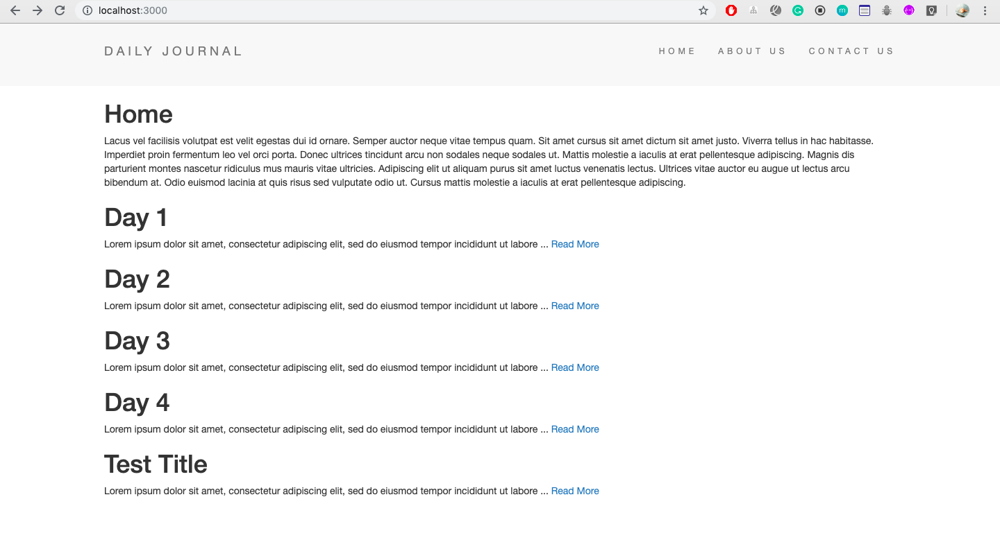

<h4 id="jumpTo">点击内容跳转到相应的页面</h4>
现在可以将用户输入的内容发布在主页上了，最后就是对每条相应的发布内容，制定一个新的详情页，可以看到发布项全部的内容。如果要给每一个发布项都分配一个新的地址的话，如果用户发布了100项，就得要有100新的界面，显然是不必要的。观察nature网站，不同的界面具有不同的后缀。

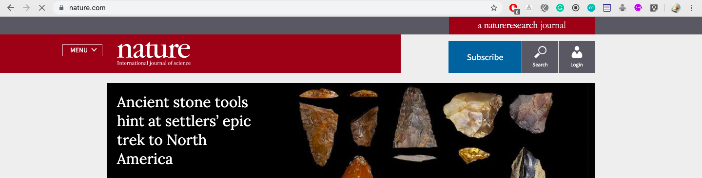

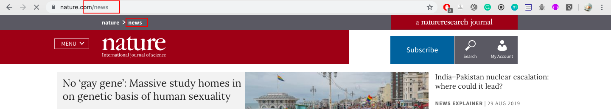

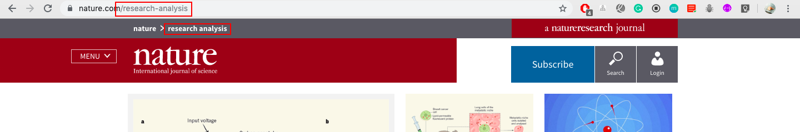

根据以上观察，我们采取通过获取访问链接后缀存储在变量中，用此变量去查找posts中相应发布内容，再将此发布内容作为变量传递到一个post的页面当中去的方法，来实现目的。这样的话，对于不同的发布内容，只需要编写一个界面就可以达到目的。
首先，现在主页每个发布项后面加上一个跳转链接，并且跳转的地址需要以发布项的名称作为后缀。

```html
<p> <%= post.content %> <a href="/posts/<%= post.title %>">Read More</a></p>
```
通过查询相关资料
(https://expressjs.com/en/guide/routing.html)
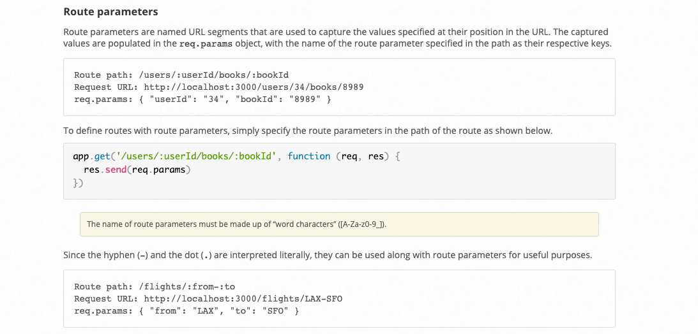

了解到，可以通过使用引号的方式获取到动态输入的不同地址，并存入变量中。
有了这一个前提，我们可以获取传入地址中的发布项名称，然后根据此发布项名称，在posts中查找这个标题对应的用户发布的内容，然后再作为传递参数传入到需要展现的页面。（说的很绕，简单来说就是获取，查找，传递！！！）

```js
app.get("/posts/:postId", function(req, res) {
    for(let i = 0; i < posts.length; i++) {
        // 在发布过的内容中寻找所需要访问内容的标题
        if(posts[i].title == postId) {
            res.render("post", {
                postTitle: posts[i].title, 
                postBody: posts[i].content
                });
        }
    }
});
```

做完这一个步骤后，就是打开post.ejs,在里面去使用传递过来的参数即可。（就问你一句，兴奋不兴奋！！！）

```html
<h1> <%= postTitle %> </h1>
<p> <%= postContent %> </p>
```

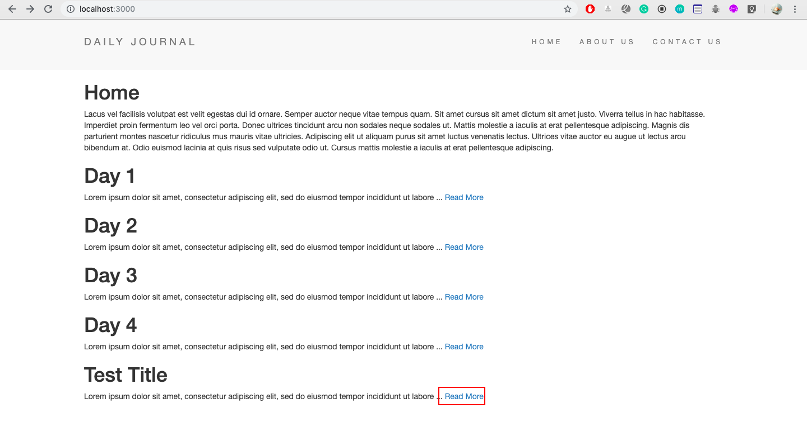

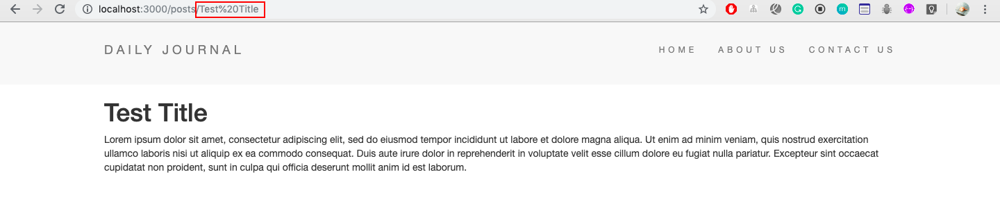

这边看到了页面成功的转至了对应的界面。（经过查找相关资料，网页浏览地址出现的"%20"代表一个空格，证明我们的操作没有问题！）
# :tada:完:tada:
开玩笑开玩笑，嘻嘻。:smile:

---
<h3 id="tips">Tips</h3>
<h4 id="npmInstall">npm Install</h4>
有的时候查看别人放在Github上面的项目只会有一个package.json文件，原因是不需要将一些庞大的安装包支持全都上传至Github中，这样还可以使自己的项目文件结构变得更加清晰。那如果我们需要下载别人的项目到自己本地上进行运行呢？但是没有对应的拓展支持，这时我们该怎么办？有两个方法，第一个是查看其项目的package.json，然后对应的自己一个一个安装；第二个方法就是这个小tip，终端打开项目所在的文件夹，直接写下<font color = red>npm install</font>,运行即会自动安装项目所需要的拓展。

(https://docs.npmjs.com/cli/install)  

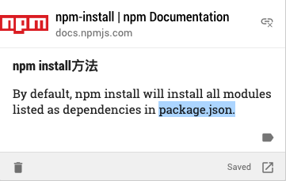
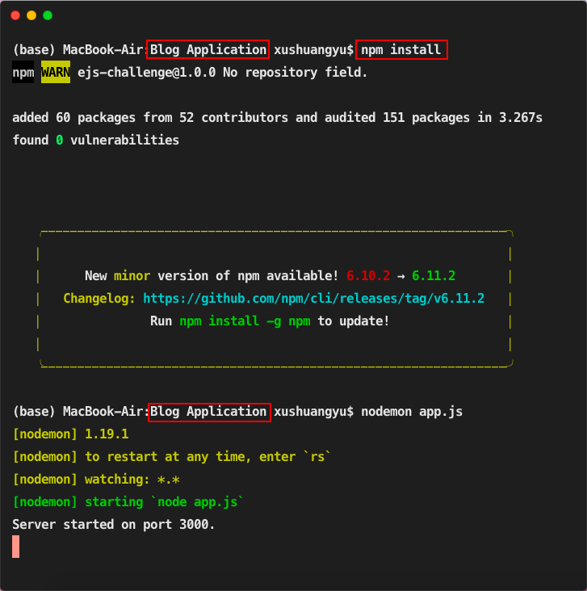

<h4 id="postOmit">首页发布项的省略</h4>
在首页发布显示的时候，我们不能将用户发布的完整内容全部写在封面上，要不然页面会看起来非常冗长和不规整。为了做到页面的统一显示，现在就仅将内容的前100个文字显示，其余的内容进行省略，用"..."代替。这里用到的是<font color = red>slice( )</font>方法。

```html
<p> <%= post.content.slice(0, 100) + " ..." %> <a href="/posts/<%= post.title %>">Read More</a></p>
```
<h4 id="futureFunction">待加入功能</h4>
根据“增、删、查、改”原则，将要加入的功能将会有：

1. 删除
2. 更改
3. 查找某一发布项的内容

---
<h3 id="apply">应用方向</h3>
个人博客，信息发布等

###### September 1，2019
